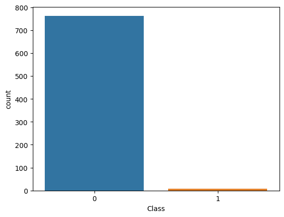
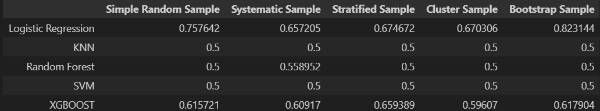

# SAMPLING_ASSIGNMENT

# Overview
## Sampling 

This repository contains Python code for implementing various sampling techniques on a credit card fraud dataset. The goal is to demonstrate how different sampling methods, specifically undersampling and oversampling, can be applied to balance imbalanced datasets.

## Dataset
The credit card fraud dataset used in this project is sourced from the following URL:
[Credit Card Fraud Dataset](https://github.com/AnjulaMehto/Sampling_Assignment/blob/main/Creditcard_data.csv)


The dataset consists of 772 rows and 31 columns, with features such as Time, V1-V28, Amount, and Class. The 'Class' column indicates whether a transaction is fraudulent (Class=1) or not (Class=0).

**Dependencies**
Before running the code, make sure to install the necessary Python libraries using the following:

```bash
pip install pandas numpy matplotlib
```

**Checking if Dataset is Balanced**
To check if the dataset is balanced or not, a bar graph is plotted using matplotlib.


<br/>

As the bar graph of the given dataset is not balanced so we applied diffrent techniques for the same.


## Sampling

Jupyter Notebook demonstrates the creation of five different samples using various sampling techniques:<br/>
* **Simple Random Sampling:** Randomly selecting a specified number of instances from the dataset.<br/>
* **Stratified Sampling:** Creating samples from each class separately to maintain the original class distribution.<br/>
* **Cluster Sampling:** Dividing the dataset into clusters and selecting entire clusters randomly.<br/>
* **Systematic Sampling:** Selecting every k-th instance from the dataset.<br/>
* **Bootstrap Sampling:** Each bootstrap sample contains elements from both class 0 and class 1.<br/>

We applied the following models on our samples and calculated their accuracies for each sample:<br/><br/>
1. Logistic Regression<br/>
2. KNN<br/>
3. Random Forest<br/>
4. SVM<br/>
5. XGBOOST<br/>

Following this, we carried out an examination where different models were employed on separate samples. Subsequently, the accuracies for each combination of model and sample were documented and systematically arranged in the tabular format presented below:<br/>

<br/>

## Conclusion


### 1.Simple Random Sampling:
Best Model: Logistic Regression

Accuracy: 0.757642


### 2.Systematic Sampling:
Best Model: Logistic Regression

Accuracy: 0.657205


### 3.Stratified Sampling:
Best Model: Logistic Regression

Accuracy: 0.674672	


### 4.Cluster Sampling:
Best Model: Logistic Regression

Accuracy: 0.670306


### 5.Bootstrap Sampling:
Best Model: Logistic Regression

Accuracy: 0.823144


## Logistic Regression consistently achieved the highest accuracy across different sampling techniques with Bootstrap Sampling having the highest accuracy.
